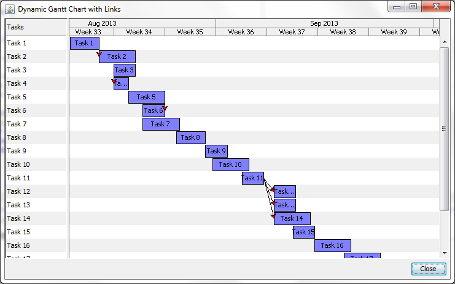

DGantt
===

DGantt is a simple Gantt chart library for Java 1.6 or later.  It allows quick
integration of both static and dynamic Gantt charts, and provides developers
full control over the rendering and look & feel of the chart.  DGantt is licensed
under the GNU Lesser General Public License, version 3 or later.
[View the Javadoc documentation](http://dhadka.github.io/DGantt/).

Other Open Source Libraries
---
  - [MOEA Framework](http://www.moeaframework.org) - A Free and Open Source Java Framework for Multiobjective Optimization
  - [TSPLIB4J](http://github.com/dhadka/TSPLIB4J) - A Java library for TSPLIB (Traveling Salesman Problems)
